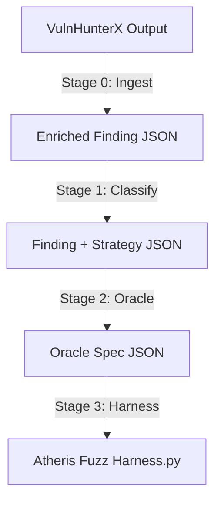

# Trace chi tiết Kiến trúc và các Giai đoạn của Oraculum

Tài liệu này trace lại toàn bộ luồng hoạt động của **Oraculum** từ đầu vào là findings của VulnHunterX cho đến đầu ra là Atheris Fuzz Harness hoàn chỉnh.

---



---

## Stage 0: Ingest (Nhập và Làm giàu Dữ liệu)

### 1. Đầu vào (Input)
*   **Thư mục kết quả từ VulnHunterX:** Chứa CodeQL database và các tệp tin CSV trích xuất ngữ cảnh (`functions.csv`, `callers.csv`, `classes.csv`, và tệp tin mới `web_params.csv` trích xuất các tham số web từ CodeQL query `web_params.ql`).
*   **Tệp tin findings JSON:** Các lỗ hổng được phát hiện bởi SAST (CodeQL/Semgrep) và được xác nhận là True Positive bởi LLM Verify của VulnHunterX.

### 2. Quá trình xử lý (What it does)
*   **Đọc finding:** Parser đọc vị trí xảy ra lỗi (tệp tin nguồn, dòng bắt đầu `start_line`, dòng kết thúc `end_line`).
*   **Ánh xạ ngữ cảnh (Context Mapping):** Sử dụng thông tin trong `functions.csv` để tìm ra hàm bao quanh (enclosing function) chứa dòng lỗi đó.
*   **Xây dựng chữ ký hàm (Signature Builder) & Web Parameters Extraction:**
    *   Trích xuất kiểu dữ liệu của các tham số hàm từ `classes.csv` và `callers.csv` để chuẩn bị cho việc sinh input fuzz.
    *   **Trích xuất tham số Web (Flask/Django view):** Đọc danh sách tham số từ `web_params.csv` (nạp từ CodeQL query). Nếu không có, Oraculum sẽ tự động phân tích cây cú pháp trừu tượng (AST) của file nguồn làm fallback để tìm các mẫu truy cập `request.args.get()`, `request.form[]`, v.v.
    *   Nếu phát hiện bất kỳ tham số web nào, chiến lược đầu vào (`input_strategy`) sẽ tự động được đặt thành `"flask_view"`.

### 3. Đầu ra (Output)
*   **Enriched Finding JSON:** Lưu tại `output/python/<repo>/verification_results/findings/finding_<id>_<rule_slug>.json`.
    *   *Nội dung nổi bật:* Chứa toàn bộ source code của tệp tin đích, siêu dữ liệu về vị trí lỗi, thông tin chữ ký hàm, và trường `web_params` (chứa các tham số web được trích xuất).
*   **Status JSON:** Lưu tại `output/python/<repo>/verification_results/status.json` tổng hợp danh sách findings đã được nhập.

---

## Stage 1: Classify (Phân loại Chiến lược Giám sát)

### 1. Đầu vào (Input)
*   Tệp tin Enriched Finding JSON từ Stage 0.

### 2. Quá trình xử lý (What it does)
*   **LLM Reasoning:** Oraculum gửi thông tin lỗi và code nguồn của hàm chứa lỗi để LLM suy luận xem nên chọn chiến lược giám sát (Monitoring Strategy) nào phù hợp nhất trong 3 loại:
    1.  `recorded_call`: Cần mock sink độc hại (ví dụ: `eval`, `subprocess.run`) và capture đối số truyền vào sink để kiểm tra.
    2.  `return_value`: Hàm là một bộ lọc/sanitizer, chỉ cần kiểm tra xem giá trị trả về có chứa payload bypass hay không.
    3.  `filesystem_state`: Hàm thực hiện ghi file, cần tạo sandbox để theo dõi sự thay đổi của hệ thống tệp tin (path traversal).
*   **Dữ liệu đưa vào LLM Prompt:**
    *   **System Prompt** (`config/prompts/classification_system.txt`): Định nghĩa nhiệm vụ và tiêu chí phân loại cho 3 chiến lược.
    *   **User Prompt** (`config/prompts/classification_user.txt`): Cung cấp code của hàm target, dòng chứa lỗi, và thông tin Dataflow (nếu có).

### 3. Đầu ra (Output)
*   **Updated Finding JSON:** File finding được ghi đè thông tin phân loại:
    *   `strategy`: (`recorded_call` | `return_value` | `filesystem_state`)
    *   `reasoning`: Lập luận của LLM.
    *   `patch_target`: Đối tượng cần mock (ví dụ: `builtins.eval` nếu chọn `recorded_call`).

---

## Stage 2: Oracle (Sinh Đặc tả Oracle)

### 1. Đầu vào (Input)
*   Tệp tin Finding JSON đã được cập nhật thông tin phân loại từ Stage 1.

### 2. Quá trình xử lý (What it does)
*   **LLM Reasoning:** Gọi LLM để sinh ra đặc tả Oracle (Oracle Spec). LLM cần suy luận ra:
    *   `trigger_patterns`: Các mẫu biểu thức chính quy (regex patterns) dùng để nhận diện payload tấn công khi nó chạm tới sink.
    *   `seed_corpus`: Các payload mẫu có khả năng kích hoạt lỗi hoặc cố gắng bypass bộ lọc.
    *   `raise_message_template`: Chuỗi thông báo khi Oracle phát hiện vi phạm.
*   **Dữ liệu đưa vào LLM Prompt:**
    *   **System Prompt** (Tùy biến theo strategy từ Stage 1):
        *   `recorded_call` $\rightarrow$ `config/prompts/oracle_system_recorded_call.txt`
        *   `return_value` $\rightarrow$ `config/prompts/oracle_system_return_value.txt`
        *   `filesystem_state` $\rightarrow$ `config/prompts/oracle_system_filesystem_state.txt`
    *   **User Prompt** (`config/prompts/oracle_user.txt`): Cung cấp code nguồn hàm target, lỗ hổng cần phát hiện, và các tham số bị tainted.

### 3. Đầu ra (Output)
*   **Oracle Spec JSON:** Lưu tại `output/python/<repo>/fuzz_oracles/<target_id>.json`.
    *   *Nội dung nổi bật:* Chứa mảng `trigger_patterns` (regex), `seed_corpus` (payloads), và metadata của sink cần mock (`patch_target`, `target_arg_index`).
    *   *Metadata đặc biệt (`_meta`):* Chứa `input_strategy` (`flask_view` hoặc `direct_params`) và `tainted_params`. Đối với `flask_view`, `tainted_params` tự động được điền danh sách các request parameters được trích xuất (với `index: -1` và `type: "str"`), chuẩn bị cho Jinja2 template ở Stage 3 dựng Flask request context.

---

## Stage 3: Harness (Sinh mã nguồn Harness hoàn chỉnh)

Đây là giai đoạn phức tạp nhất, kết hợp giữa render mẫu tĩnh (Jinja2 Template) và LLM để sinh code động.

### 1. Đầu vào (Input)
*   Oracle Spec JSON từ Stage 2.
*   Enriched Finding JSON từ Stage 0.

### 2. Quá trình xử lý (What it does)

#### Bước A: Đổ dữ liệu vào Jinja2 Template (Boilerplate Rendering)
Oraculum đọc file template [base_harness.j2](file:///home/tuonglnc/repo/Oraculum/src/oraculum/harness/templates/base_harness.j2) và sử dụng dữ liệu từ Oracle Spec và Finding để render ra khung xương (Skeleton) của file Python.

*   **Các biến được truyền vào Jinja2 Template Context:**
    *   `rule_id`: ID của lỗi (ví dụ: `py/code-injection`).
    *   `function_name`: Tên hàm target (`v02_eval_string_concat`).
    *   `file_path`: Tệp tin chứa hàm target (`vulnerable_app.py`).
    *   `import_stmts`: Câu lệnh import tự động sinh ra (`from vulnerable_app import v02_eval_string_concat`).
    *   `trigger_patterns`: Mảng các regex đã sinh ở Stage 2.
    *   `raise_message`: Thông điệp lỗi khi crash.
    *   `patch_target`: Đối tượng mock (ví dụ: `builtins.eval`).
    *   `target_arg_index`: Vị trí đối số cần kiểm tra của sink (ví dụ: `0`).
    *   `input_strategy`: Chiến lược input (ví dụ: `flask_view`).
*   **Khung xương được sinh ra (Skeleton):**
    Chứa đầy đủ các cấu hình tĩnh, import, và regex compiled patterns. Phần duy nhất để trống (placeholder) là thân hàm `TestOneInput(data)` và danh sách `_SEED_CORPUS`:
    ```python
    def TestOneInput(data):
        fdp = atheris.FuzzedDataProvider(data)
        # [FILL HERE — follow the skeleton above]

    _SEED_CORPUS = [
        # [FILL HERE — at least 6 bypass-attempt strings]
    ]
    ```

#### Bước B: Gọi LLM để hoàn thiện mã nguồn (LLM Completion)
Oraculum gửi toàn bộ khung xương (Skeleton) vừa render ở Bước A cho LLM để nó tự động điền thân hàm `TestOneInput` và mảng `_SEED_CORPUS`.

*   **Dữ liệu đưa vào LLM Prompt:**
    *   **System Prompt** (Tùy biến theo strategy):
        *   `recorded_call` $\rightarrow$ `config/prompts/harness_system_recorded_call.txt` (hướng dẫn LLM cách lấy dữ liệu từ `fdp`, dựng `with patch`, gọi hàm target và duyệt qua `mock_obj.call_args_list` để kiểm tra regex).
    *   **User Prompt** (`config/prompts/harness_user.txt`): Truyền chuỗi khung xương Skeleton thô để LLM viết tiếp vào.

#### Bước C: Xác thực cú pháp và Lưu đĩa
*   Oraculum chạy `ast.parse(llm_code)` để đảm bảo LLM không sinh sai cú pháp Python.
*   Ghi đè file mã nguồn harness hoàn chỉnh ra đĩa.
*   Đồng thời ghi các chuỗi trong `_SEED_CORPUS` thành các tệp tin nhị phân trong thư mục corpus để cung cấp đầu vào ban đầu cho Atheris.

### 3. Đầu ra (Output)
*   **Atheris Fuzz Harness:** Tệp tin Python hoàn chỉnh chạy được tại `output/python/<repo>/fuzz_targets/<target_id>.py`.
*   **Seed Corpus Files:** Các file seed được ghi tại `output/python/<repo>/fuzz_corpus/<target_id>/seed_00*`.
*   **Status JSON:** Lưu tại `output/python/<repo>/fuzz_targets/status.json` tổng hợp kết quả của Stage 3.
